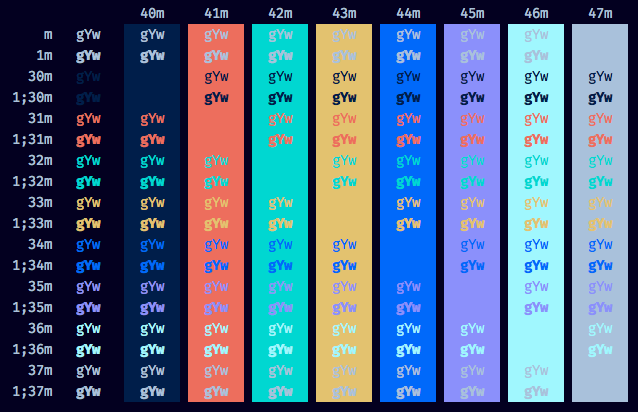

# DigitalOcean colorscheme for iTerm2

A color palette for iTerm2 made with colors picked from
[DigitalOcean's website](https://www.digitalocean.com/)

## Preview

## How to use it

* Clone the repo or download the file `DigitalOcean.itermcolors`
* `iTerm2 > Preferences > Profiles > Colors` Tab
* Click `Color Presets`
* Click `Import`
* Select the `DigitalOcean.itermcolors` file
* Select the `DigitalOcean` from Load Presets

## Colors

| Color            | Code      |
|------------------|-----------|
| Background dark  | `#030021` |
| Background light | `#061E4C` |
| Text             | `#ACC1DC` |
| Red              | `#E46D59` |
| Blue             | `#0069FF` |
| Green            | `#00D7D2` |
| Yellow           | `#DFC267` |
| Cyan             | `#ABF7FF` |
| Magenta          | `#8E90FF` |
